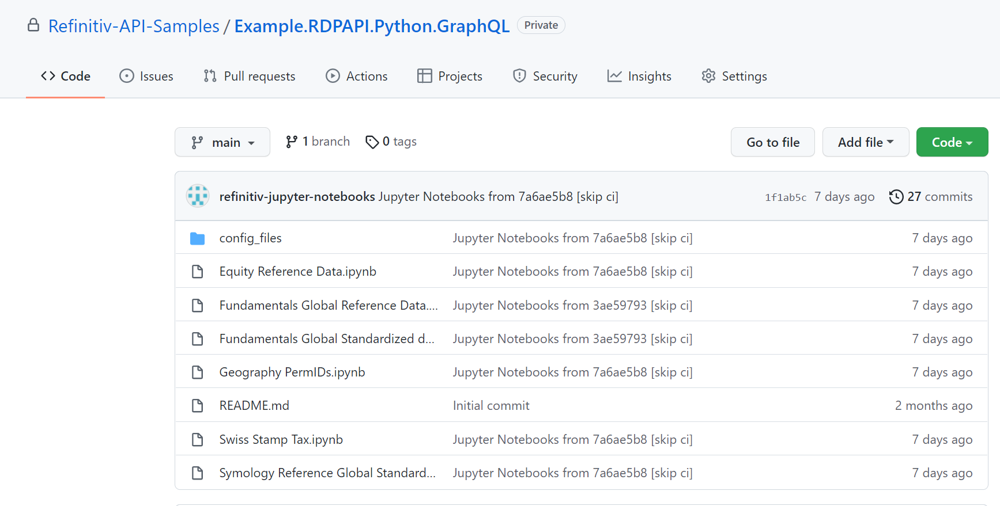
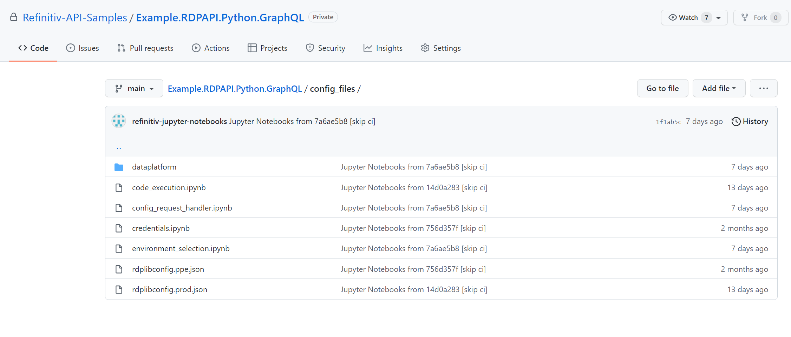
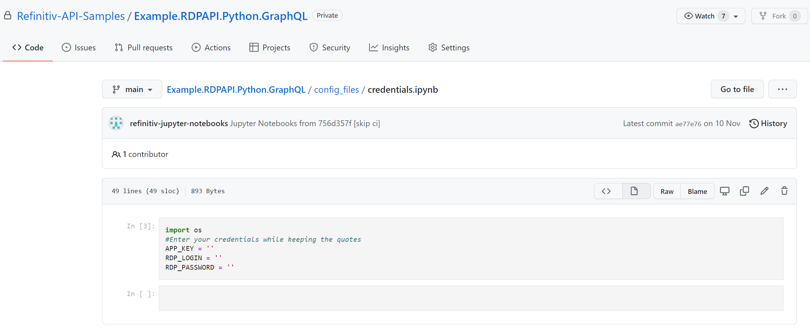
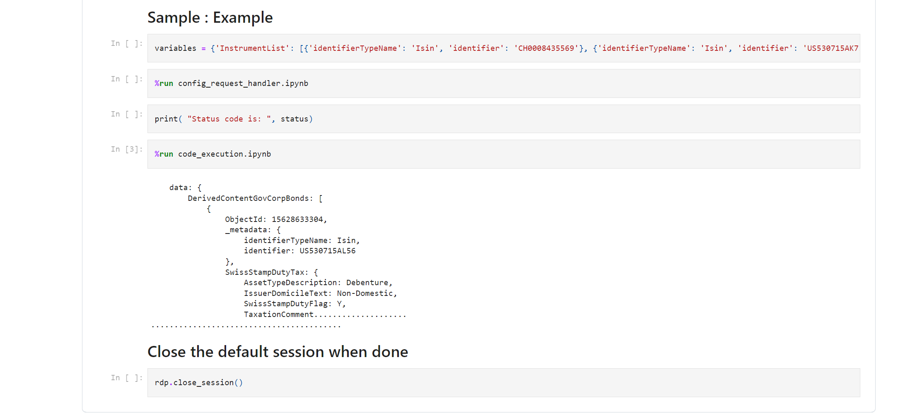
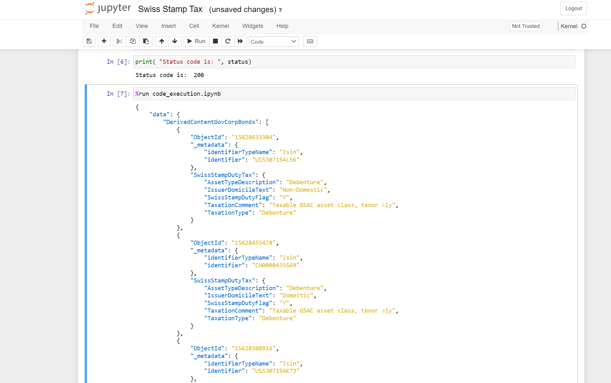
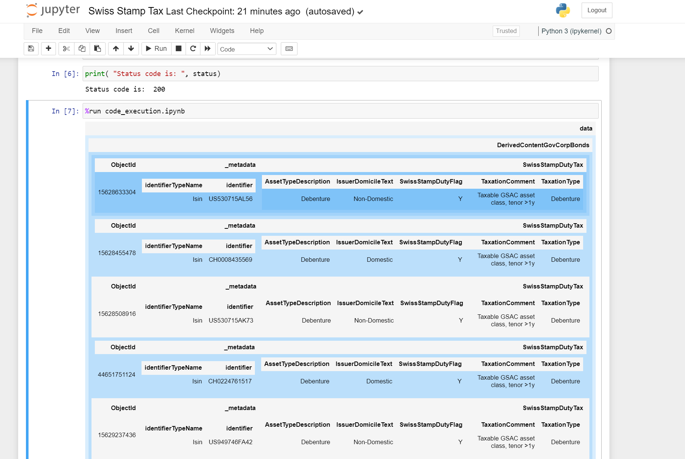

# Jupyter Notebooks for pre-canned GraphQL queries

## Summary

This repository includes samples of the Refinitiv GraphQL queries that are pre-canned. It means that
you can run these GraphQL queries with the predefined fields and variables. This helps you
understand how to build the Refinitiv GraphQL queries and see the example of the Refinitiv data you
can fetch.

The samples use [Jupyter Notebooks](https://jupyter.org/) that demonstrate how to use GraphQL
queries with the Refinitiv Data Library for Python.

This library provides a set of functions and classes that gives your applications a uniform access
to the breadth and depth of financial data and services available on the Refinitiv Data Platform.

## Instruction

> **Note**
>
> Each sample is in its dedicated directory, for example Equity, Financial Instruments, or
> Geography. To execute the `.ipynb` Jupyter Notebook files in the sample directory, download or clone
> this Github repository to your local machine on which the Python program is installed. Then use
> the `pip` or `conda` package managers to install the Jupyter Notebook library to your local machine.

To run the pre-canned queries:

1. Go to the `config_files` directory.

   

2. Open the `credentials.ipynb` file.

   

3. Enter your credentials information.

   In this step don't delete the single quotes characters, put your credentials information inside
   them instead.

   

4. In the root directory, go to one of the sample directories that contain the query file you want
   to execute.

   For example, open the `Financial Instruments` directory that contains the `Swiss Stamp Tax.ipynb`
   file.

5. View the partial JSON response of the query before you execute it.

   It's below the `%run code_execution.ipynb` line.

   

6. Execute the Jupyter Notebook cells all at once (or from the
   first input cell if you clicked the Run button one by one in order).

If your credentials are correct, the output view will change to the full display output.

According to the configuration of the sample file, the output file may be formed in the table format
as
well. In this format, each shade of the blue color represents different depths of the graph.

